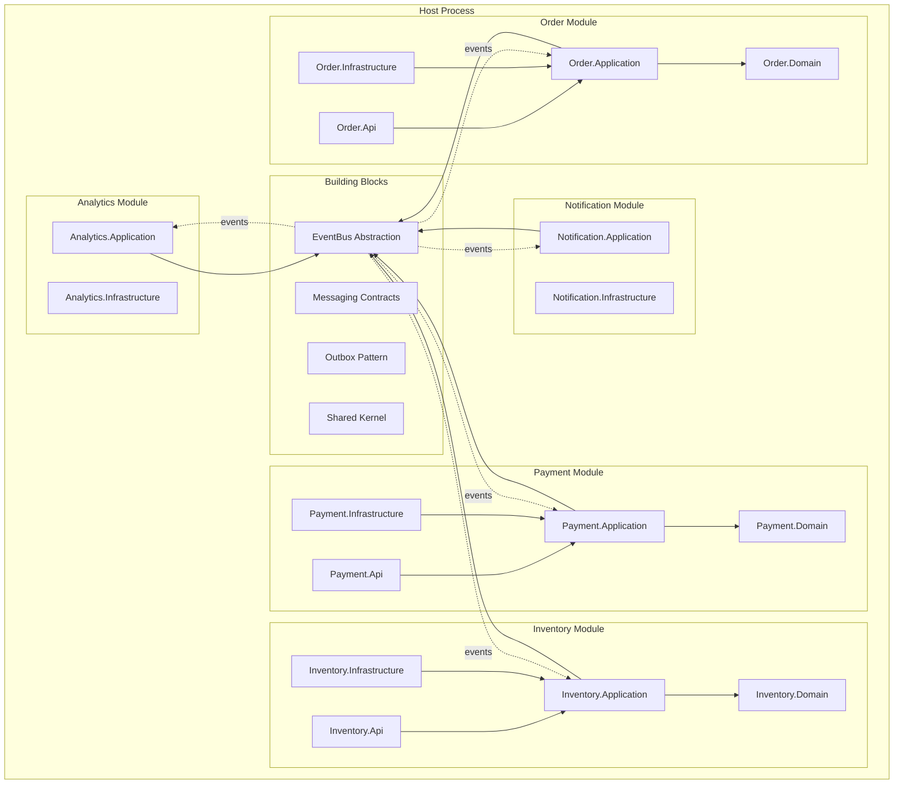
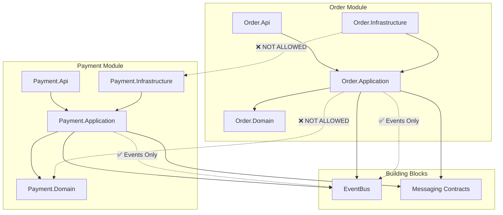
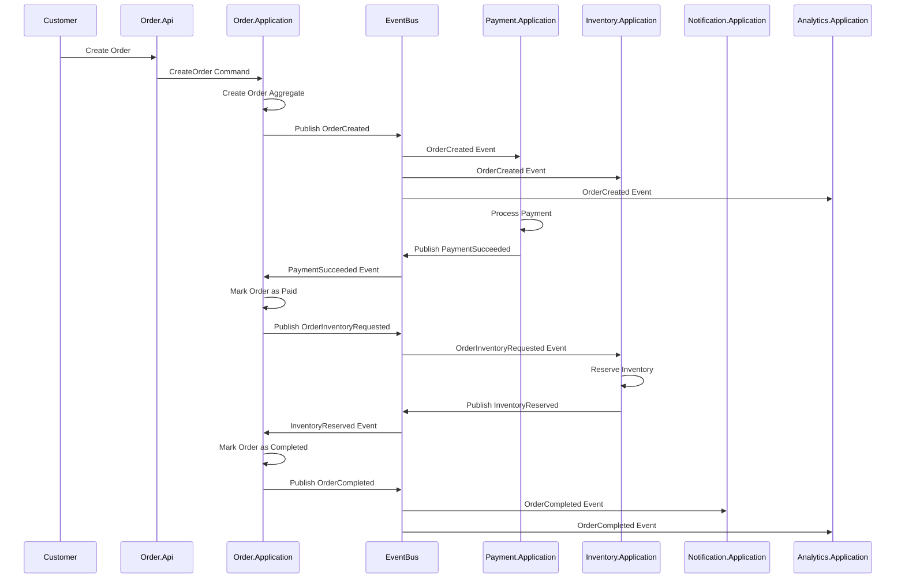
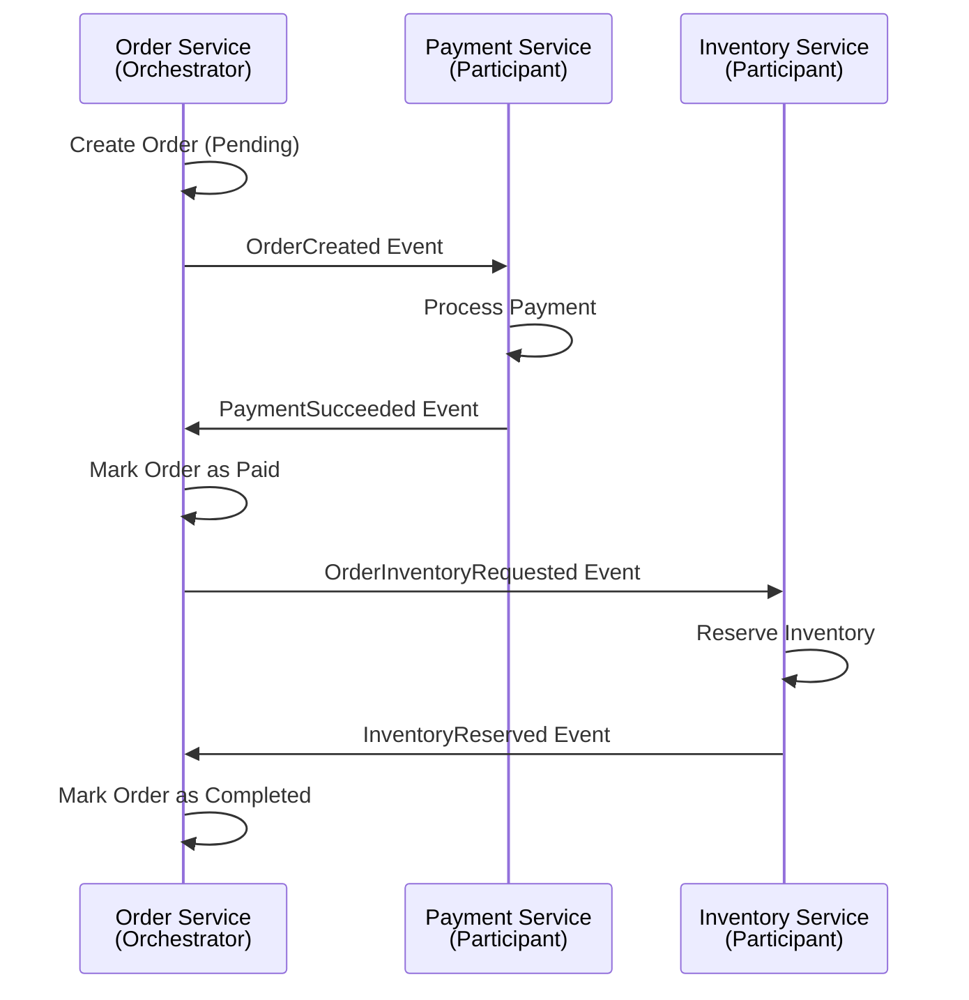
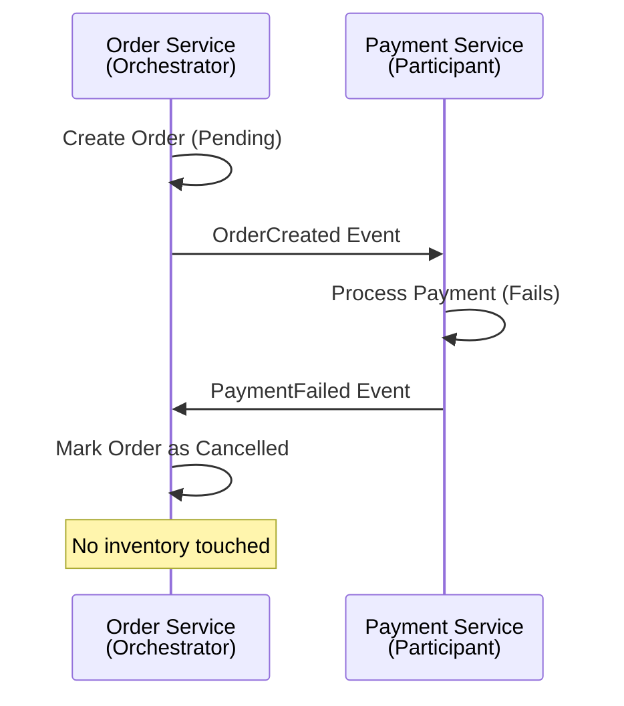
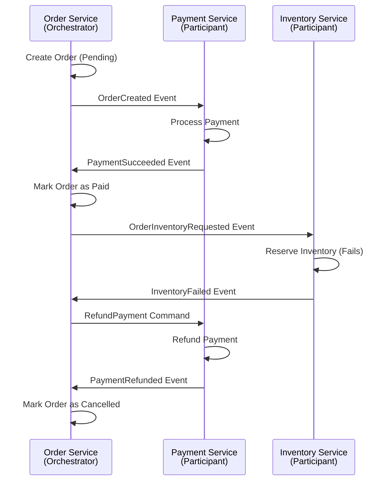
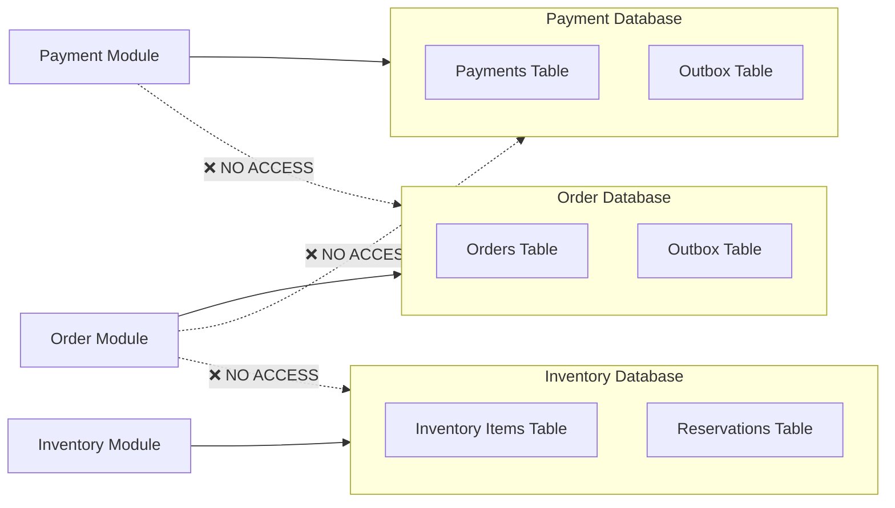

# Event-Driven Order Processing System

> **Practice Project**: This project is designed for **learning and practicing microservices architecture** and **Domain-Driven Design (DDD)**. It implements a modular monolith that demonstrates microservices patterns, event-driven communication, saga orchestration, and clean architecture principles.

## Overview

This document describes the architecture of the **Event-Driven Order Processing System** implemented as a **Modular Monolith** that is microservices-ready.

### Core Principle

**One bounded context = one module = one future microservice**

We organize by **business capability**, not technical layers globally. Each module is designed as a future microservice, making extraction a deployment decision, not a redesign.

### System Type

- **Modular Monolith** (current phase)
- **Microservices-Ready** (future phase)

### Technology Stack

- **Runtime**: .NET (ASP.NET Core)
- **Message Broker**: In-memory EventBus (current) → RabbitMQ (future)
- **Cache**: Redis (future)
- **Database**: SQL Server (logically separated per module)
- **Architecture Pattern**: DDD + Clean Architecture per module

---

## Solution Structure

The solution is organized by bounded contexts (business capabilities), not by technical layers.

```
EventDrivenOrderSystem.sln
│
├── src/
│   │
│   ├── BuildingBlocks/
│   │   ├── EventBus/
│   │   ├── Messaging/
│   │   ├── Outbox/
│   │   └── SharedKernel/
│   │
│   ├── Order/
│   │   ├── Order.Domain/
│   │   ├── Order.Application/
│   │   ├── Order.Infrastructure/
│   │   └── Order.Api/
│   │
│   ├── Payment/
│   │   ├── Payment.Domain/
│   │   ├── Payment.Application/
│   │   ├── Payment.Infrastructure/
│   │   └── Payment.Api/
│   │
│   ├── Inventory/
│   │   ├── Inventory.Domain/
│   │   ├── Inventory.Application/
│   │   ├── Inventory.Infrastructure/
│   │   └── Inventory.Api/
│   │
│   ├── Notification/
│   │   ├── Notification.Application/
│   │   └── Notification.Infrastructure/
│   │
│   └── Analytics/
│       ├── Analytics.Application/
│       └── Analytics.Infrastructure/
│
└── host/
    └── Bootstrapper/
        └── WebHost
```

### Key Characteristics

**This is NOT a traditional monolith:**
- ❌ Controllers/ Services/ Repositories/ Entities (layer-based)
- ❌ Everything talks to everything

**This IS a modular monolith:**
- ✅ Order talks to Order (within its own module)
- ✅ Payment talks to Payment (within its own module)
- ✅ No cross-module references at compile time
- ✅ Communication only via events

---

## Module Architecture Diagram



---

## Module Details

### Order Module (Saga Orchestrator)

**Bounded Context:** Order Service  
**Role:** Saga Orchestrator - owns order lifecycle and coordinates the order saga

#### Responsibilities
- Owns the order lifecycle (Pending → Paid → Completed/Cancelled)
- Orchestrates the order saga workflow
- Acts as the source of truth for order state
- Manages saga state and compensation

#### Structure
```
Order/
├── Order.Domain/
│   ├── Aggregates/
│   │   └── Order.cs
│   ├── ValueObjects/
│   │   └── OrderItem.cs
│   ├── Events/
│   │   └── OrderCreated.cs
│   └── Rules/
│
├── Order.Application/
│   ├── Commands/
│   │   └── CreateOrder.cs
│   ├── CommandHandlers/
│   ├── Saga/
│   │   └── OrderSaga.cs
│   └── Ports/
│
├── Order.Infrastructure/
│   ├── Persistence/
│   │   └── OrderDbContext.cs
│   ├── Outbox/
│   └── Messaging/
│
└── Order.Api/
    └── Controllers/
        └── OrdersController.cs
```

#### Data Owned
- Orders
- Order status (Pending, Paid, Completed, Cancelled)
- Saga state (orderId, paymentId, reservationId)

#### Events Published
- `OrderCreated`
- `OrderPaymentRequested`
- `OrderInventoryRequested`
- `OrderCompleted`
- `OrderCancelled`

#### Events Consumed
- `PaymentSucceeded`
- `PaymentFailed`
- `InventoryReserved`
- `InventoryFailed`
- `PaymentRefunded`

---

### Payment Module

**Bounded Context:** Payment Service  
**Role:** Participant - processes payments and handles refunds

#### Responsibilities
- Processes payments (charging money)
- Handles refunds (compensation)
- Financially authoritative context
- Must be idempotent

#### Structure
```
Payment/
├── Payment.Domain/
│   ├── Aggregates/
│   │   └── Payment.cs
│   ├── ValueObjects/
│   ├── Events/
│   │   ├── PaymentSucceeded.cs
│   │   ├── PaymentFailed.cs
│   │   └── PaymentRefunded.cs
│   └── Rules/
│
├── Payment.Application/
│   ├── Commands/
│   ├── CommandHandlers/
│   └── Ports/
│
├── Payment.Infrastructure/
│   ├── Persistence/
│   │   └── PaymentDbContext.cs
│   ├── Outbox/
│   └── Messaging/
│
└── Payment.Api/
    └── Controllers/
```

#### Data Owned
- Payments
- Payment transactions
- Payment status (Succeeded, Failed, Refunded)

#### Events Published
- `PaymentSucceeded`
- `PaymentFailed`
- `PaymentRefunded`

#### Events Consumed
- `OrderPaymentRequested`

---

### Inventory Module

**Bounded Context:** Inventory Service  
**Role:** Participant - manages inventory and stock reservation

#### Responsibilities
- Manages inventory availability
- Handles stock reservation
- Decides whether items can be reserved
- Owns stock quantities

#### Structure
```
Inventory/
├── Inventory.Domain/
│   ├── Aggregates/
│   │   └── InventoryItem.cs
│   ├── ValueObjects/
│   ├── Events/
│   │   ├── InventoryReserved.cs
│   │   ├── InventoryFailed.cs
│   │   └── InventoryReleased.cs
│   └── Rules/
│
├── Inventory.Application/
│   ├── Commands/
│   ├── CommandHandlers/
│   └── Ports/
│
├── Inventory.Infrastructure/
│   ├── Persistence/
│   │   └── InventoryDbContext.cs
│   └── Messaging/
│
└── Inventory.Api/
    └── Controllers/
```

#### Data Owned
- Inventory items
- Stock levels
- Reservations

#### Events Published
- `InventoryReserved`
- `InventoryFailed`
- `InventoryReleased`

#### Events Consumed
- `OrderInventoryRequested`
- `ReleaseInventory` (command)

---

### Notification Module

**Bounded Context:** Notification Service  
**Role:** Observer - sends user-facing notifications

#### Responsibilities
- Sends notifications (email, SMS, push)
- Best-effort context (must never block business flows)
- No business-critical state

#### Structure
```
Notification/
├── Notification.Application/
│   ├── EventHandlers/
│   └── Ports/
│
└── Notification.Infrastructure/
    ├── Email/
    ├── Sms/
    └── Messaging/
```

#### Data Owned
- Notification logs
- Delivery attempts
- Templates (optional)

#### Events Consumed
- `OrderCompleted`
- `OrderCancelled`
- `PaymentFailed`

#### Events Published
- None (side effects only)

---

### Analytics Module

**Bounded Context:** Analytics Worker  
**Role:** Observer - collects and processes business events

#### Responsibilities
- Collects business events for reporting
- Processes events for analytics
- Eventually consistent by design
- Never used for transactional decisions

#### Structure
```
Analytics/
├── Analytics.Application/
│   ├── EventHandlers/
│   └── Ports/
│
└── Analytics.Infrastructure/
    ├── Persistence/
    └── Messaging/
```

#### Data Owned
- Analytics events
- Aggregated metrics
- Reports

#### Events Consumed
- `OrderCreated`
- `OrderCompleted`
- `OrderCancelled`
- `PaymentSucceeded`
- `PaymentFailed`

#### Events Published
- Optional `AnalyticsProcessed`

---

## Dependency Rules

### Within-Module Dependency Direction

Each module follows Clean Architecture + DDD:

```
Api → Application → Domain
Infrastructure → Application
```

**Critical Rule:** Domain never depends on anything

### Cross-Module Communication Rules

#### ❌ What We Do NOT Allow
- Order referencing `Payment.Domain`
- Inventory accessing `Order.DbContext`
- Shared entity models
- Direct service-to-service calls
- Cross-module data access

#### ✅ What We Allow
- Communication only via events
- Events are DTO contracts (not domain objects)
- Published through shared `EventBus` abstraction
- Events defined in `BuildingBlocks/Messaging/`

### Dependency Graph



---

## Communication Patterns

### Event-Driven Communication

All inter-module communication happens via events through the EventBus abstraction. This mirrors real microservices communication.

### Communication Flow Diagram



### Saga Orchestration Flow

The Order Service acts as the saga orchestrator, coordinating the entire order processing workflow.

#### Happy Path Sequence



#### Payment Failure Path



#### Inventory Failure Path (Compensation)



---

## Data Ownership

### Database Per Module (Logical Separation)

Each module owns its own database/logical schema:

- **Order Module**: `Orders` database (Orders table, Outbox table)
- **Payment Module**: `Payments` database (Payments table, Outbox table)
- **Inventory Module**: `Inventory` database (InventoryItems table, Reservations table)
- **Notification Module**: `Notifications` database (NotificationLogs table)
- **Analytics Module**: `Analytics` database (AnalyticsEvents table, Metrics table)

### Data Ownership Rules

1. **Ownership Rule**: A bounded context is the **only writer** of its data
2. **No Cross-Module Data Access**: No module accesses another module's database
3. **Event-Based Synchronization**: Modules share data only via events (eventual consistency)
4. **No Distributed Transactions**: Each module manages its own transactions

### Persistence Boundaries



---

## Evolution Path: Modular Monolith → Microservices

### Current State: Modular Monolith

```
┌─────────────────────────────────────┐
│  Single Process (ASP.NET Core)     │
│                                     │
│  ┌─────────┐ ┌─────────┐ ┌────────┐│
│  │ Order   │ │Payment  │ │Inventory││
│  │ Module  │ │ Module  │ │ Module ││
│  └─────────┘ └─────────┘ └────────┘│
│                                     │
│  ┌─────────┐ ┌─────────┐           │
│  │Notify   │ │Analytics│           │
│  │ Module  │ │ Module  │           │
│  └─────────┘ └─────────┘           │
│                                     │
│  EventBus (In-Memory)              │
└─────────────────────────────────────┘
```

### Future State: Microservices

```
┌──────────────┐  ┌──────────────┐  ┌──────────────┐
│Order Service │  │Payment Service│  │Inventory     │
│              │  │              │  │Service       │
│              │  │              │  │              │
│ Own DB       │  │ Own DB       │  │ Own DB       │
└──────┬───────┘  └──────┬───────┘  └──────┬───────┘
       │                 │                 │
       └─────────────────┼─────────────────┘
                         │
              ┌──────────▼──────────┐
              │   RabbitMQ          │
              │  (Message Broker)   │
              └──────────┬──────────┘
                         │
       ┌─────────────────┼─────────────────┐
       │                 │                 │
┌──────▼───────┐  ┌──────▼───────┐  ┌──────▼───────┐
│Notification  │  │Analytics     │  │API Gateway   │
│Service       │  │Service       │  │              │
│              │  │              │  │              │
│ Own DB       │  │ Own DB       │  │              │
└──────────────┘  └──────────────┘  └──────────────┘
```

### Extraction Process

To extract Order Service from modular monolith to microservice:

1. **Take the module**: Copy `/Order/*` folder (all projects: Domain, Application, Infrastructure, Api)
2. **Create new solution**: Create `OrderService.sln`
3. **Replace EventBus**: Swap in-memory EventBus with RabbitMQ implementation
4. **Update host**: Create standalone `OrderService.Api` as entry point
5. **Keep everything else**: All domain logic, application logic, handlers stay the same

**No redesign. No refactor. Just deployment change.**

### What Changes vs What Stays the Same

#### ✅ Stays the Same
- Domain models (Aggregates, Value Objects, Events)
- Application logic (Commands, Handlers, Saga)
- Business rules and validation
- Event contracts
- Saga orchestration logic

#### 🔄 Changes
- Deployment unit (single process → multiple processes)
- EventBus implementation (in-memory → RabbitMQ)
- Host/startup code (shared host → service-specific host)
- Database connection strings (shared server → separate servers)

---

## Key Principles

### Design Principles

1. **One bounded context = one module = one future microservice**
2. **Organization by business capability**, not technical layers globally
3. **DDD + Clean Architecture** per module
4. **Event-only communication** between modules
5. **No shared domain models** or cross-module references
6. **Compile-time boundary enforcement**

### Communication Principles

1. **Commands express intent** (what you want to happen)
2. **Events express facts** (what has happened)
3. **At-least-once delivery** (events may be duplicated)
4. **Idempotent consumers** (all event handlers must be idempotent)
5. **No distributed transactions** (eventual consistency via saga)

### Consistency Principles

1. **Eventual consistency** by design
2. **Saga orchestration** for business consistency
3. **Compensation** for failure scenarios
4. **No cross-module data access**
5. **Own data ownership** per module

---

## Summary

This architecture implements a **Modular Monolith** that:

- ✅ Enforces bounded contexts at compile time
- ✅ Organizes by business capability (not technical layers)
- ✅ Uses event-driven communication (mirrors microservices)
- ✅ Applies DDD + Clean Architecture per module
- ✅ Prepares for clean extraction to microservices

Each module is designed as a future microservice, making the transition from modular monolith to microservices a **deployment decision**, not a redesign.

